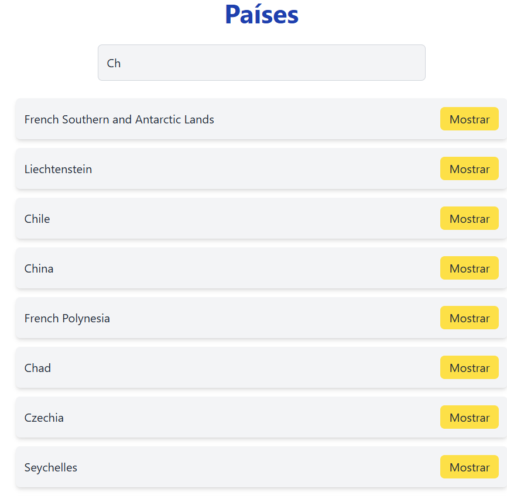
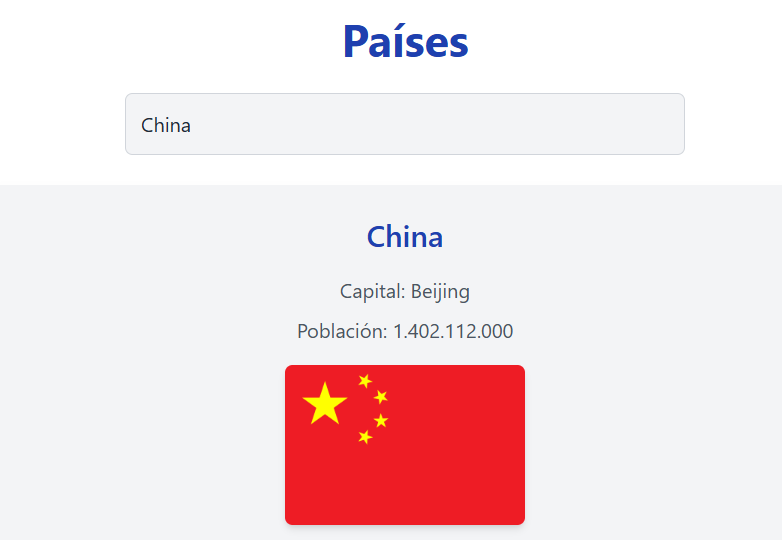

## Descripción General

`apiPaises` es una aplicación web que permite a los usuarios buscar países y visualizar sus datos (nombre, población, capital, bandera) obtenidos de la API pública `https://studies.cs.helsinki.fi/restcountries/api/all`. La aplicación utiliza un buscador para filtrar países en tiempo real y muestra los resultados de forma dinámica.

## Tecnologías Usadas

- **React 19**: Framework para construir la interfaz de usuario.
- **Vite**: Herramienta de construcción y servidor de desarrollo para un entorno rápido y eficiente.
- **Tailwind CSS 3.4.14**: Framework CSS para un diseño responsivo y estilizado.
- **Axios 1.8.1**: Librería para realizar solicitudes HTTP a la API.
- **Node.js**: Entorno de ejecución para gestionar dependencias y scripts.
- **npm**: Gestor de paquetes para instalar y manejar dependencias del proyecto.


## Funcionalidad del Buscador

- Filtrar países en tiempo real según el texto ingresado por el usuario.

**Implementación**:

- Un estado `filtro` (`setFiltro`) captura el texto del input de búsqueda (`<input type="text" value={filtro} onChange={onchangeFilter} />`).
- La función `onchangeFilter` actualiza `filtro` con cada cambio en el input (`setFiltro(event.target.value)`).
- El array `filtrar` se genera dinámicamente filtrando `paises` según el texto en `filtro`:
  - `paises.filter(pais => pais.name.common.toLowerCase().includes(filtro.toLowerCase()))`.
  - Comparación insensible a mayúsculas/minúsculas para mayor usabilidad.
- Resultados condicionales:
  - Si hay más de 10 coincidencias (`filtrar.length > 10`), muestra un mensaje: "Demasiados países, por favor sea más específico".
  - Si hay entre 2 y 10 coincidencias (`filtrar.length > 1`), muestra una lista de países con un botón "Mostrar" para ver detalles.
  - Si hay una coincidencia (`filtrar.length === 1`), muestra los detalles del país.
  - Si no hay coincidencias, muestra: "No se encontraron países".
- **Archivos**:
  - `src/App.jsx`: Contiene la lógica del buscador y el renderizado condicional.

## Presentación de Datos

- Mostrar población y bandera de los países, junto con otros datos relevantes.

- **Archivos**:
  - `src/App.jsx`: Contiene las clases de Tailwind CSS.
  - `src/index.css`: Incluye las directivas de Tailwind (`@tailwind base; @tailwind components; @tailwind utilities;`).

## Configuración del Proyecto

1. **Estructura**:
   - `src/App.jsx`: Componente principal con la lógica y el diseño.
   - `src/main.jsx`: Punto de entrada que importa `index.css`.
   - `src/index.css`: Archivo CSS con las directivas de Tailwind.
   - `index.html`: Plantilla base.
2. **Dependencias**:
   - Instala React, Axios y Tailwind CSS:

     ```bash
     npm install react@19.0.0 react-dom@19.0.0 axios@1.8.1
     npm install -D tailwindcss@3.4.14 postcss@8.5.3 autoprefixer@10.4.21
     ```
3. **Configuración de Tailwind CSS**:
   - Genera los archivos de configuración:

     ```bash
     npx tailwindcss init -p
     ```
   - Configura `tailwind.config.js` para incluir los archivos del proyecto:

     ```js
     content: ["./index.html", "./src/**/*.{js,ts,jsx,tsx}"]
     ```
4. **Ejecutar**:
   - Inicia el servidor de desarrollo:

     ```bash
     npm run dev
     ```
   - Abre `http://localhost:5173` para probar la aplicación.


**Visualización**



